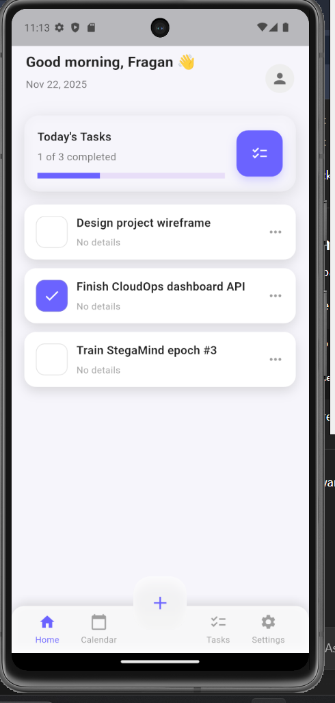
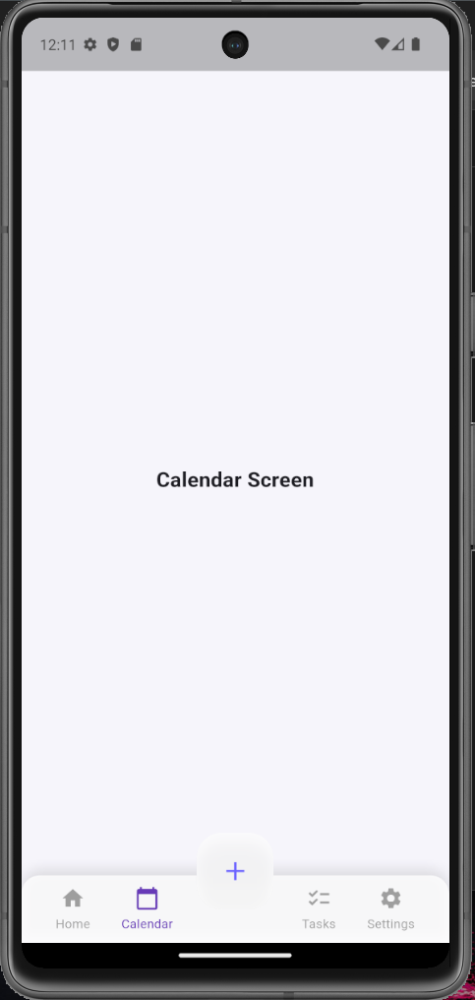
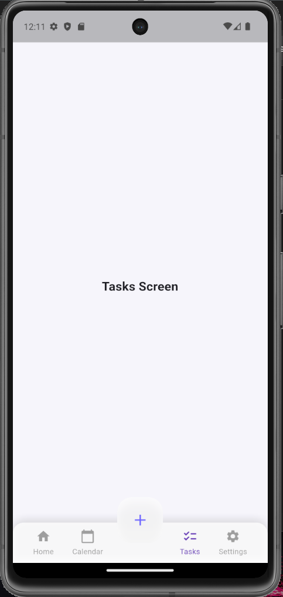
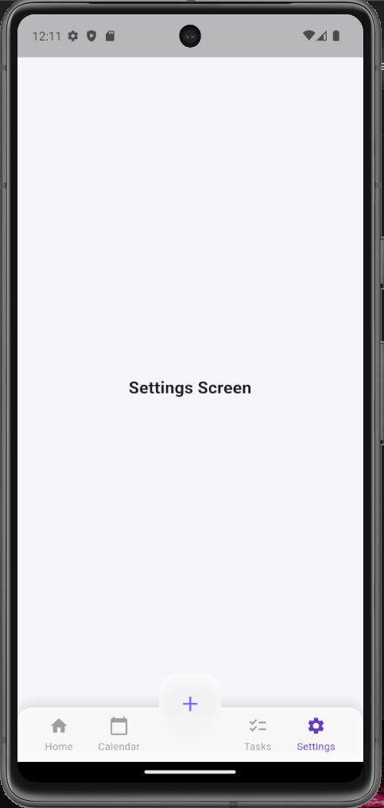

# 📱 Productivity Mobile App

A beautifully designed **Flutter-based productivity application** built to help users manage tasks, track daily progress, and stay organized — all wrapped in a smooth **iOS-inspired UI** with frosted glass effects.

Built using **Flutter**, leveraging **Material + Cupertino design**, and optimized for both **Android** and **iOS** devices.

---

## ⚙️ Features

### ✅ 🏠 Home Dashboard

* Dynamic greeting with date
* Clean summary card that displays:

  * **Tasks completed**
  * **Total tasks**
  * **Progress bar**
* Frosted-glass UI elements with smooth animations

### ✅ 📝 Task Management

* Add new tasks via a **bottom sheet**
* Mark tasks as complete with a tap
* Beautiful task cards with glass-morphism styling

### ✅ 📅 Calendar View

* Clean and minimal integrated calendar screen
* (Future-ready for scheduling + events)

### ✅ ⚙️ Settings

* Theme-aware design (dark/light mode responsive)
* Placeholder for upcoming preferences/customizations

### ✅ 👤 Profile

* Profile screen with avatar, name, and account options
* Modular settings such as Notifications, Appearance, Privacy, Help

### ✅ 🧊 Frosted UI Components

Custom-built reusable widgets:

* `FrostedBottomNav`
* `FrostedFab`
* `TaskCard`
* `AddTaskSheet`

---

## 🧩 Technical Overview

### 🏗️ App Architecture

| Layer          | Components                                         | Description                                       |
| :------------- | :------------------------------------------------- | :------------------------------------------------ |
| **UI Layer**   | Screens (Home, Tasks, Calendar, Profile, Settings) | Builds layouts, animations, and user interactions |
| **Controller** | Navigation Controller                              | Manages screen switching and FAB behavior         |
| **Model**      | Task Model                                         | Represents task objects across the app            |
| **Widgets**    | Reusable UI components                             | Modular frosted UI components and cards           |

---

## 📁 Project Structure

```text
Productivity-Mobile-App/
│
├── lib/
│   ├── screens/
│   │   ├── home_screen.dart
│   │   ├── calendar_screen.dart
│   │   ├── tasks_screen.dart
│   │   ├── settings_screen.dart
│   │   ├── profile_screen.dart
│   │   └── navigation_controller.dart
│   │
│   ├── widgets/
│   │   ├── frosted_bottom_nav.dart
│   │   ├── frosted_fab.dart
│   │   ├── task_card.dart
│   │   └── add_task_sheet.dart
│   │
│   ├── models/
│   │   └── task.dart
│   │
│   └── main.dart
│
├── android/  (Native Android build files)
├── ios/      (Native iOS build files)
├── pubspec.yaml
└── README.md
```

---

## 🚀 Setup & Installation

### 1️⃣ Install Dependencies

Run:

```bash
flutter pub get
```

---

### 2️⃣ Run the App

For Android emulator:

```bash
flutter run
```

For Chrome/Web:

```bash
flutter run -d chrome
```

---

### 3️⃣ Project Requirements

Ensure you have:

* Flutter SDK (3.7+)
* Android SDK + emulator
* VS Code or Android Studio
* Dart extensions installed

---

## 🧪 Usage

### ➕ Add a Task

1. Press the **center frosted button (FAB)**
2. Enter task name
3. Hit **Add Task**

### ✔️ Complete a Task

* Tap on any task card — it toggles instantly

### 🧭 Navigate Across App

* Bottom nav lets you switch between:

  * Home
  * Calendar
  * Tasks
  * Settings
  * Profile

---

## 🎨 UI Highlights

* iOS-style **glassmorphism UI**
* Smooth blur effects (`BackdropFilter`)
* Adaptive color scheme for light/dark
* Clean typography and spacing

---

## 📸 Screenshots

### ⭐ App Preview



### 📅 Calendar



### 📝 Tasks



### ⚙️ Settings



---


## 📌 Notes

* This project is perfect for **Flutter beginners** building their portfolio.
* Modular structure makes it easy to expand (task categories, reminders, databases, etc.)
* Future upgrade options:

  * Hive/SQLite local database
  * Notifications
  * Custom themes
  * User authentication

---

## 👨‍💻 Author

**Fragan D'Souza**

📎 [LinkedIn](https://linkedin.com/in/fragan-dsouza) <br>
💻 [GitHub](https://github.com/fragan7dsouza)
---

## 📜 License

This project is open-source under the **MIT License**.

